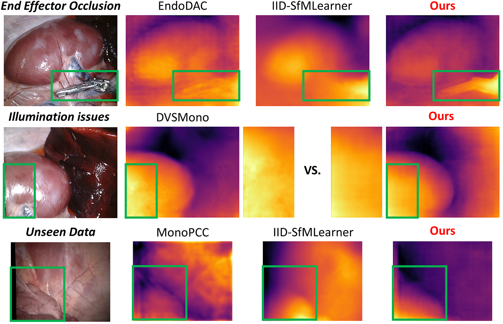

# EndoMUST: Monocular Dpth Estimation for Robotic <ins>Endo</ins>scopy via End-to-end <ins>Mu</ins>lti-step <ins>S</ins>elf-supervised <ins>T</ins>raining
Here is the pre-released code implementation for "**EndoMUST: Monocular Depth Estimation for Robotic Endoscopy via End-to-end Multi-step Self-supervised Training**". 

We revisit the self-supervised training strategy for endoscopy depth estimation, to jointly tackle all kinds of challenges.



:newspaper: **News:**
- [X] 🚩 Evaluation Code and Weights have been Released.
- [ ] :dart: The further work on sim-to-real is on-going.


## Table of Contents
📑 If you want to get back this section for navigation, click the [Back to ToC](#table-of-contents) at the beginning of each section.
- [Installation](#installation)
- [Prepare Datasets](#datasets)
- [Prepare Pretrained Weights](#pretrained-weights)
- [Results](assets/Results.md)
- Evaluation of [Depth Estimation](#evaluation-of-depth-estimation) and [Ego-motion + Camera Intrinsics Estimation](#evaluation-of-ego-motion-and-camera-intrinsics-estimation)
- [Acknowledgements](#acknowledgements)

## Installation
[Back to ToC](#table-of-contents)

:computer: Our implementation system: 
- Ubuntu 22.04
- NVIDIA Geforce RTX 4090 GPU (At least 24GB GPU memory)
- Pytorch 2.0.0 + CUDA 11.8

Our environment packages: in [env.yaml](env.yaml)

:heavy_exclamation_mark: (Some packages are used for implementation of existing works, e.g. `mmengine` for MonoViT used in MonoPCC and DVSMono.)

:file_folder: You also need dowloading the [pretrained Depth Anything-B model](https://huggingface.co/spaces/LiheYoung/Depth-Anything/tree/main/checkpoints) into ./pretrained_model

## Datasets
[Back to ToC](#table-of-contents)

The experiments are implemented on two main-stream **public** endoscopic datasets :file_folder: for self-supervised depth estimation and zero-shot depth estimation.
- **SCARED dataset**: Train/Validation/Evaluation [Website](https://endovissub2019-scared.grand-challenge.org/)

- **Hamlyn dataset**: Zero-shot Evaluation [Website](http://hamlyn.doc.ic.ac.uk/vision/)

_**Sincerely thanks for their great contributions to the community!!!**_

## Pretrained Weights
[Back to ToC](#table-of-contents)

The existing models pretrained on SCARED dataset :floppy_disk: can be downloaded from the following links:

**EndoDAC**: [in section **Results**](https://github.com/BeileiCui/EndoDAC?tab=readme-ov-file#results)

**MonoPCC**: [in section **Evaluation on SCARED**](https://github.com/adam99goat/MonoPCC?tab=readme-ov-file#-evaluation-on-scared)

**DVSMono**: [in **AF_training_split/README.md**](https://github.com/adam99goat/DVSMono/blob/main/AF_training_split/README.md#comparison-with-sotas-using-the-training-split-of-af-sfmlearner)

**IID-SfMLearner**: [in section **Prediction for a single image**](https://github.com/bobo909/IID-SfmLearner?tab=readme-ov-file#%EF%B8%8F-prediction-for-a-single-image) ONLY weights for depth estimation, for ego-motion estimation: [GoogleDrive](), [BaiduCloud]()

**AF-SfMLearner**: [in section **Model Zoo/End-to-End**](https://github.com/ShuweiShao/AF-SfMLearner?tab=readme-ov-file#-model-zoo)

**Depth Anything (Finetuned)**: [GoogleDrive](), [BaiduCloud]()

**Depth Anything v2 (Finetuned)**: [GoogleDrive](), [BaiduCloud]()

---
**Ours**: [GoogleDrive](), [BaiduCloud]()

**Ablations**: [GoogleDrive](), [BaiduCloud]()

## Evaluation of Depth Estimation
[Back to ToC](#table-of-content)

Firstly, the ground truth of depth maps in SCARED dataset needs to be exported by the following code.
```
python export_gt_depth.py --data_path <your data path>
```
Then, you can use the following code to evlauate various models on datasets:
```
python evaluate_depth.py --data_path <your data path> --eval_mono --eval_split <dataset> --model_type <model used for eval> --load_weights_folder <weight path> \
--lora_type <method for LoRA> --learn_intrinsics <with/without camera intrinsics> --visualize_depth
```

`--eval_split`: SCARED dataset---`endovis`  Hamlyn dataset---`hamlyn` 

`--visualize_depth`: if you don't want to visualize the qualitative resullts, delete it when running.

The **arguments setting** for different models are shown as the following table:

|Models|`--model_type`|`--lora_type`|`--learn_intrinsics`|
|:---|:---:|:---:|:---:|
|Ours/Ablations|`endomust`|`dvlora`|`True`|
|EndoDAC|`endomust`|`part-dvlora`|`True`|
|MonoPCC|`pcc`|`none`|`False`|
|DVSMono|`pcc`|`none`|`False`|
|IID-SfMLearner|`afsfm`|`none`|`False`|
|AF-SfMLearner|`afsfm`|`none`|`False`|
|Depth Anything v1/v2|`depthanything`|`none`|`False`|

## Evaluation of Ego-motion and Camera Intrinsics Estimation
[Back to ToC](#table-of-content)

Firstly, the ground truth of ego-motion sequences needs to be exported by the following code.
```
python export_gt_pose.py --data_path <your data path> --sequence <sequence to export>
```
Note that `--sequence` needs to be set as `sequence1`, `sequence2`, `sequence3` one by one

Then, you can use the following code to evlauate various models on all three sequences:
```
python evaluate_pose.py --data_path <your data path> --eval_mono --eval_split <dataset> --load_weights_folder <weight path> --learn_intrinsics <with/without camera intrinsics>
```
The **arguments settings** are similar to the settings for depth estimation, without `--model_type`, "--lora_type" and `--visualize_depth`. 


## Acknowledgements
[Back to ToC](#table-of-contents)

_Sincerely thank the following related works for their remarkable contribution to the community, as well as their inspiration and code support to this work!_ :kissing_heart:

- [MonoPCC](https://github.com/adam99goat/MonoPCC): Novel idea of cycle transformation constraints for training
- [DVSMono](https://github.com/adam99goat/DVSMono): Excellent idea of pose alignment-friendly dynamic view selection for training
- [EndoDAC](https://github.com/BeileiCui/EndoDAC): Innovative idea of parameter-efficient finetuning for endoscopic scenes
- [IID-SfMLearner](https://github.com/bobo909/IID-SfmLearner): Novel idea to deal with the illumination issues
- [Depth Anything](https://github.com/DepthAnything): Milestone for general depth estimation --- Move forward to [Depth Anything v2](https://github.com/DepthAnything/Depth-Anything-V2)
- [AF-SfMLearner](https://github.com/ShuweiShao/AF-SfMLearner): Milestone for depth estimation in endoscopy
