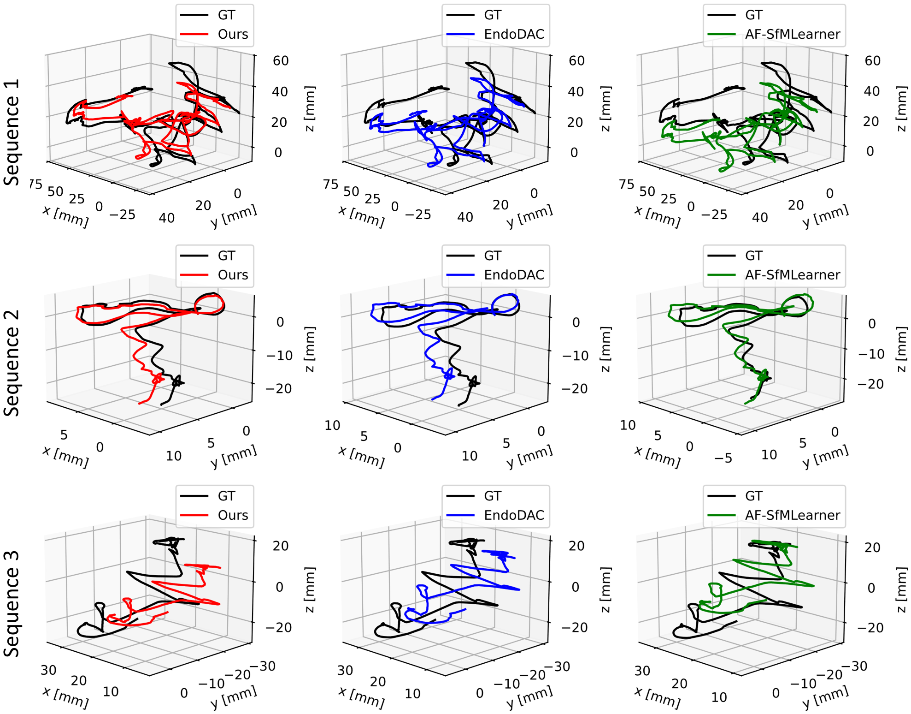

# EndoDEER: Monocular <ins>De</ins>pth <ins>E</ins>stimation for <ins>R</ins>obotic <ins>Endo</ins>scopy via End-to-end Self-supervised Training with Multistage Efficient Finetuning
Here is the pre-released code implementation for "**EndoDEER: Monocular Depth and Ego-motion Estimation for Robotic Endoscopy via End-to-end Self-supervised Training with Multistage Efficient Finetuning**". 

This work revisited the parameter-efficient finetuning for depth estiamtion in robotic endoscopy from the perspective of the training strategy.

**News:**
- [X] Evaluation Code and Weights have been Released.
- [ ] The further work on sim-to-real is on-going.

## Table of Contents
If you want to get back this section for navigation, click the [Back to ToC](#table-of-contents) at the beginning of each section.
- [Installation](#installation)
- [Prepare Datasets](#datasets)
- [Prepare Pretrained Weights](#pretrained-weights)
- Results of [Depth Estimation](#results-of-depth-estimation) and [Ego-motion + Camera Intrinsics Estimation](#results-of-ego-motion-estimation-and-camera-intrinsics-prediction)
- Evaluation of [Depth Estimation](#evaluation-of-depth-estimation) and [Ego-motion + Camera Intrinsics Estimation](#evaluation-of-ego-motion-estimation-and-camera-intrinsics-prediction)
- [Acknowledgements](#acknowledgements)

## Installation
[Back to ToC](#table-of-contents)

Our implementation system: 
- Ubuntu 22.04
- NVIDIA Geforce RTX 4090 GPU (At least 24GB GPU memory)
- Pytorch 2.0.0 + CUDA 11.8

Our environment packages: in [env.yaml](env.yaml)

(Some packages are used for implementation of existing works, e.g. `mmengine` for MonoViT used in MonoPCC and DVSMono.)

You also need dowloading the [pretrained Depth Anything-B model](https://huggingface.co/spaces/LiheYoung/Depth-Anything/tree/main/checkpoints) into ./pretrained_model

## Datasets
[Back to ToC](#table-of-contents)

The experiments are implemented on two main-stream **public** endoscopic datasets for self-supervised depth estimation and zero-shot depth estimation.
- **SCARED dataset**: Train/Validation/Evaluation [Website](https://endovissub2019-scared.grand-challenge.org/)

- **Hamlyn dataset**: Zero-shot Evaluation [Website](http://hamlyn.doc.ic.ac.uk/vision/)

_**Sincerely thanks for their great contributions to the community!!!**_

## Pretrained Weights
[Back to ToC](#table-of-contents)

The existing models pretrained on SCARED dataset can be downloaded from the following links:

**EndoDAC**: [in section **Results**](https://github.com/BeileiCui/EndoDAC?tab=readme-ov-file#results)

**MonoPCC**: [in section **Evaluation on SCARED**](https://github.com/adam99goat/MonoPCC?tab=readme-ov-file#-evaluation-on-scared)

**DVSMono**: [in section **Evaluation**](https://github.com/adam99goat/DVSMono/tree/main?tab=readme-ov-file#-evaluation)

**IID-SfMLearner**: [in section **Prediction for a single image**](https://github.com/bobo909/IID-SfmLearner?tab=readme-ov-file#%EF%B8%8F-prediction-for-a-single-image) ONLY weights for depth estimation, for ego-motion estimation: [here]()

**AF-SfMLearner**: [in section **Model Zoo/End-to-End**](https://github.com/ShuweiShao/AF-SfMLearner?tab=readme-ov-file#-model-zoo)

**Depth Anything (Finetuned)**: 

**Depth Anything v2 (Finetuned)**: 

_**Sincerely thanks the above remarkable works for their contributions to the community!**_

**Ours**: 

**Ablations**:

## Results of Depth Estimation
[Back to ToC](#table-of-contents)

1. CI: `Pred.` denotes that **Camera Intrinsics** are **Predicted**.
2. *: Results form the **public provided weights**.
3. \^: Model **finetuned** on SCARED dataset.
### SCARED dataset
|Methods|From|CI|Abs Rel|Sq Rel|RMSE|RMSE Log|$\delta$|
|:---|:---|:---:|:---:|:---:|:---:|:---:|:---:|
|AF-SfMLearner|**MedIA'22**|Given|0.059|0.435|4.925|0.082|0.974|
|Yang et al.|**TMI'24**|Given|0.062|0.558|5.585|0.090|0.962|
|Depth Anything\^|**CVPR'24**|Given|0.055|0.410|4.769|0.078|0.973|
|Depth Anything v2\^|**NeurIPS'24**|Given|0.076|0.683|6.379|0.104|0.949|
|IID-SfMLearner|**JBHI'24**|Given|0.058|0.435|4.820|0.080|0.969|
|DVSMono|**BIBM'24**|Given|0.055|0.410|4.797|0.078|0.975|
|MonoPCC|**arXiv'24**|Given|0.051|0.349|4.488|0.072|0.983|
|EndoDAC|**MICCAI'24**|Pred.|0.052|0.362|4.464|0.072|0.979|
|**EndoDEER**|**Ours**|**Pred.**|**0.047**|**0.315**|**4.246**|**0.067**|**0.984**|

### Hamlyn dataset (Zero-shot)
|Methods|From|CI|Abs Rel|Sq Rel|RMSE|RMSE Log|$\delta$|
|:---|:---|:---:|:---:|:---:|:---:|:---:|:---:|
|AF-SfMLearner|**MedIA'22**|Given|0.168|4.440|13.870|0.204|0.770|
|Depth Anything\^|**CVPR'24**|Given|0.154|3.616|12.733|0.189|0.784|
|Depth Anything v2\^|**NeurIPS'24**|Given|0.182|4.994|15.067|0.219|0.740|
|IID-SfMLearner*|**JBHI'24**|Given|0.171|4.526|14.066|0.206|0.767|
|DVSMono*|**BIBM'24**|Given|0.143|2.956|11.905|0.181|0.796|
|MonoPCC*|**arXiv'24**|Given|0.158|3.889|13.205|0.194|0.782|
|EndoDAC|**MICCAI'24**|Pred.|0.156|3.854|12.936|0.193|0.791|
|**EndoDEER**|**Ours**|**Pred.**|**0.140**|**3.087**|**11.700**|**0.174**|**0.813**|

## Results of Ego-motion estimation and Camera Intrinsics Prediction
[Back to ToC](#table-of-content)
### Quantitative Results of Ego-motion Estimation
The results are calculated by Absolute Translation Error(ATE). **The best results** are in bold, while <ins>the second best results</ins> are underlined.
|Methods|From|CI|Seq. 1|Seq. 2|Seq. 3|
|:---|:---|:---:|:---:|:---:|:---:|
|AF-SfMLearner|**MedIA'22**|Given|<ins>0.0941</ins>|0.0742||
|IID-SfMLearner|**JBHI'24**|Given|0.1040|0.0781||
|MonoPCC|**arXiv'24**|Given|0.1040|0.0781||
|EndoDAC|**MICCAI'24**|Pred.|0.0936|0.0776||
|**EndoDEER**|**Ours**|**Pred.**|**0.0927**|<ins>0.0754</ins>|**0.0678**|

### Qualitative Results of Ego-motion Estimation

### Quantitative Results of Camera Intrinsics Estimation
The results are displayed as `value(relative error)`
|Methods|fx|fy|cx|cy|
|:---|:---:|:---:|:---:|:---:|
|GT|0.8200|1.0200|0.5000|0.5000|
|EndoDAC*|0.8610(5.00%)|1.0778(5.67%)|0.4917(1.66%)|0.5101(2.02%)|
|**EndoDEER**|0.8158(**0.51%**)|1.0232(**0.31%**)|0.4949(**1.02%**)|0.4951(**0.98%**)|

## Acknowledgements
[Back to ToC](#table-of-contents)

_Sincerely thanks the following related works for their remarkable contribution to the community and their inspiration to this work!_
- [MonoPCC](https://github.com/adam99goat/MonoPCC): Novel idea of cycle transformation constraints for training
- [DVSMono](https://github.com/adam99goat/DVSMono): Excellent idea of pose alignment-friendly dynamic view selection for training
- [EndoDAC](https://github.com/BeileiCui/EndoDAC): Innovative idea of parameter-efficient finetuning for endoscopic scenes
- [IID-SfMLearner](https://github.com/bobo909/IID-SfmLearner): Novel idea to deal with the illumination issues
- [Depth Anything](https://github.com/DepthAnything): Milestone for general depth estimation --- Move forward to [Depth Anything v2](https://github.com/DepthAnything/Depth-Anything-V2)
- [AF-SfMLearner](https://github.com/ShuweiShao/AF-SfMLearner): Milestone for depth estimation in endoscopy
